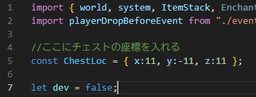

# GoldRush-BE

### 概要
マイクラゴールドラッシュを統合版でプレイできるようにするアドオンです。

### 使い方
#### 1. 事前準備
   1. ワールドに入ったらまずタグ「admin」を付ける。 
   ` /tag @s add admin `
   2. ワールドに入りなおす。
   3. 見えないところにチェストを置き、最上段に右からヘルメット、チェストプレート、レギンス、ブーツの順で赤く染色した皮装備を入れる。
   4. 上から2段目に右からヘルメット、チェストプレート、レギンス、ブーツの順で青く染色した皮装備を入れる。
   5. このアドオンの` scripts/main.js `を開き、下の画像のように` ChestLoc `にチェストの座標を入れる。
      ****
   6. 赤の羊毛と青の羊毛でチーム分けする地点を設定する。
   7. レッドストーンブロックとラピスラズリブロックで金の納品地点を設定する。
   8. インベントリの右上の棒を使って石を鉱石にする。 
   (金鉱石50％、石炭鉱石14％、ラピス鉱石13％、レッドストーン鉱石10％、エメラルド鉱石10％、ダイヤモンド鉱石3％)
   9. 参加者がチームの色の羊毛または鉱石ブロックの上にいることを確認して、インベントリの右上のネザースターを右クリックしてスタートする。
#### **2. ゲームの概要** 
   1. 金を掘って自分のチームの鉱石ブロックの上でスニークして金を納品する。
   2. プレイヤーは殺しても構わない。
   3. 殺された場合、所持していた金はロストする。
   4. ラストスパートでは、金の納品個数が2倍になり、両チームとも金の個数のカウント表示は消える。

### 注意事項
   1. 敵チームの鉱石ブロックの上でスニークしても金は納品されるが、その鉱石ブロックの色のチームのポイントになる。
   2. フレンドリーファイアあり(無効化設定は準備中)。
   3. 誤って開始した場合は` /function goldrush_stop `で終了することができる。
   4. アイテムは極力捨てれないようになっているが、特定の場合のみ捨てることができる。 
      その場合、アイテムは消失する。
   5. 死亡時の復活クールタイムはない。
   6. ワールドに入ったとき、所持しているアイテムは消去される。

### アップデート
   2025/03/05 
   > ゲームの開始時に鉱石の生成率、鉱石の再生成時間、試合時間、ラストスパートの時間、フレンドリーファイアの有無(未実装)を変更できるようになりました。 
   > 鉱石の生成率を変更して、「開発モード(開始しません)」を有効化すると棒を使った鉱石生成の確率が変化します。

### スペシャルサンクス
[Naru8521様 MinePack](https://github.com/Naru8521/MinePack)より[playerDropBeforeEvent](https://github.com/Naru8521/MinePack/blob/main/scripts/events/playerDropBeforeEvent.js)
